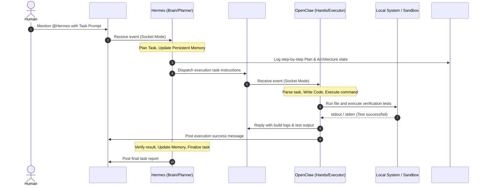

# Multi-Agent System Architecture (Hermes & OpenClaw)

This document describes the multi-agent architecture built for the **Forge 2 Edition 1 Qualifier**.

## Agent Roles

### 1. Hermes (The Brain / Planner)
- **Primary Role:** Orchestration, task decomposition, memory preservation, and scheduling.
- **Workflow:**
  - Listens for direct mentions in the main communication channel (`#sprint-main`).
  - Reads persistent memory from the local database (`data/memory.db`) to retrieve context from previous sessions.
  - Decomposes the high-level human prompt into a structured, step-by-step execution plan.
  - Logs the active plan to the auditing channel (`#agent-log`).
  - Formulates code-generation and command-execution tasks and dispatches them to the developer channel (`#agent-coder`).
  - Runs a background cron job to trigger periodic `status-report` skills.

### 2. OpenClaw (The Hands / Coder)
- **Primary Role:** Code writing, file operations, command execution, and test verification.
- **Workflow:**
  - Listens for dispatched plan items in the developer channel (`#agent-coder`).
  - Synthesizes code contents based on the instructions, writes them to files in the repository workspace.
  - Runs local terminal commands to execute programs or build scripts.
  - Executes validation suites (such as unit tests or health-checks) to verify correctness.
  - Returns raw logs, execution reports, and test results back to the Slack channel (`#agent-coder`).

## Slack Channel Layout

1. **`#sprint-main`**: Main channel for human operators to direct Hermes and view completed status updates.
2. **`#agent-coder`**: Inter-agent communication channel where Hermes dispatches instructions and OpenClaw reports execution logs.
3. **`#agent-log`**: Audit and monitoring channel where Hermes writes detailed planning steps, state changes, and session memory proofs.
